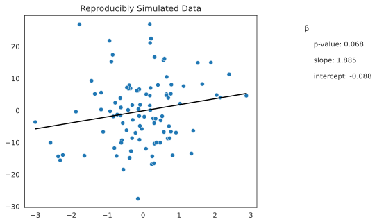

# reproduce-work

<!-- WARNING: THIS FILE WAS AUTOGENERATED! DO NOT EDIT! -->

### Main features:

- ✅ Computational reproducibility across all major operating systems
  and platforms
- ✅ A simple and intuitive API that fits into your existing workflow
- ✅ Verifiable, traceable, reproducible results in scientific documents
- ✅ Author in markdown with seemless *full-powered* LaTeX support (not
  just MathJax, folks)

### Roadmap features:

- 🔳 Fancy HTML outputs
- 🔳 Data validation, versioning, and provenance tracking
- 🔳 Support for more target publishers and document formats
- 🔳 Deep linking to verified open data and code

## Current support

Currently, we have examples and templates for the following workflows: -
[Jupyter](https://jupyter.org/) -
[Rmarkdown/RStudio](https://rmarkdown.rstudio.com/) -
[R](https://www.r-project.org/) - [Python](https://www.python.org/) -
[Julia](https://julialang.org/)

Creating new templates [(link coming soon]()) is easy and encouraged for
any workflow that can be containerized. The goal is to provide a
framework that can be used to create a reproducible workflow for any
computational task.

<!--
Future targets:
- [MATLAB](https://www.mathworks.com/products/matlab.html)
- [Stata](https://www.stata.com/)
- [SAS](https://www.sas.com/en_us/home.html)
- [SPSS](https://www.ibm.com/analytics/spss-statistics-software)
- [Mathematica](https://www.wolfram.com/mathematica/)
- [Maple](https://www.maplesoft.com/products/maple/)
-->

## Philosophy

The objective of this software is to facilitate a version open science
with reproducibility of computational results in published scientific
work. The software is developed to integrate with existing computing
paradigms and development workflows, including any docker-targeted build
system. The goal is to accomodate the vast space of computation and
logic that counts as “scientific computing” while providing a framework
that constrains the core essence of scientific publishing to an ontology
that facilitates and encourages reproducibile practices for humans both
producing and consuming science.

### Long-term prospects

reproduce.work has published the v0.0.1 release of its software. This
includes an open-sourcing of the key standards that facilitate our
vision of open science, which can be seen online and will always remain
free. Our intention is for our software to work at full capacity without
cost for those using self-hosted storage and compute resources.

In the future, we may develop cloud-based services that provide turn-key
solution for those who want the convenience of data versioning,
verification, and perpetual storage without the hassle of self-hosting.
Such services may be available for a fee. However, as mentioned, core
standards and software will always remain free and open source.

## Installation

``` sh
pip install reproduce_work
```

## How to use

### Getting started

``` python
import reproduce_work
from reproduce_work.core import generate_config,read_base_config
from reproduce_work.dynamic import publish_variable,publish_data,publish_file,register_notebook
```

    Setting reproduce.work config dir to ./reproduce
    Setting reproduce.work config dir to ./reproduce

Generate configuration at beginning of your project

``` python
generate_config(inputs={
    'authors': {
        'author1': {
            'name': 'Alex P. Miller',
            'email': 'alex.miller@marshall.usc.edu',
            'affiliation': 'USC Marshall School of Business'
        }
     },
     'project': {
        'github_repo': 'reproduce-work/reproduce-work',
     },
     'nbdev_project': True,
     'dev_image_tag': 'reproduce-work-dev',
     #'verbose': True # enables print statements whenever data are updated/saved
})
```

    Successfully generated reproduce.work configuration at reproduce/config.toml

``` python
register_notebook('index.ipynb')
```

    True

Run code to analyze data and generate figures

``` python
import numpy as np
import seaborn as sns
import matplotlib.pyplot as plt
from scipy.stats import linregress

plt.rcParams['figure.figsize'] = [6, 5]

random_state = np.random.RandomState(552)

# Generate data
x = random_state.normal(size=100)
y = 0.5*x + random_state.normal(scale=10, size=100)

# Plot data with seaborn
sns.set_style('white')

# compute slope and stats
slope, intercept, r_value, p_value, std_err = linregress(x, y)

# plot x-y scatter data
x_y_plot = sns.scatterplot(x=x, y=y)

# plot best fit line
x_y_plot.plot(x, intercept + slope*x, color='black')

# Compute p-value of slope 
# render p-value with 3 decimal places and no scientific notation
p_value_str = f'{p_value:.3f}'

# add p-value and slope to plot
x_y_plot.text(x=4.5, y=25, s='β')
x_y_plot.text(x=4.75, y=20, s=f'p-value: {p_value_str}')
x_y_plot.text(x=4.75, y=15, s=f'slope: {slope:.3f}')
x_y_plot.text(x=4.75, y=10, s=f'intercept: {intercept:.3f}')

# Set title
x_y_plot.set_title('Reproducibly Simulated Data')

# save figure
plt.savefig('reproducible_plot.svg', bbox_inches='tight')
```



There are three primary types:

- named variables
  - defined via: `reproduce_work.publish_variable`
  - Designed to be used to facilitate production and review of
    reproducible results
- data assignments
  - defined via: `reproduce_work.publish_data`
  - Designed to standardize data management and facilitate data
    validation
- file assignments
  - defined via: `reproduce_work.publish_file`
  - Designed to standardize file management and facilitate file
    validation, allowing for reproducible workflows for arbitrarily
    complex data structures

``` python
publish_variable(p_value_str, "p_value_str", metadata={
    'description': 'The p-value of the coefficient on the slope of the linear regression line.',
})
```

``` python
publish_data(x, "x", metadata={
    'description': 'The simulated X data',
    'units': 'kilograms'
})
```

``` python
publish_data(y, "y", metadata={
    'description': 'The simulated Y data',
    'units': 'meters'
})
```

``` python
publish_file('reproducible_plot.svg', metadata={
    'description': 'A plot of X vs Y',
})
```

    <IPython.core.display.Javascript object>

``` python
base_config = read_base_config()
with open(base_config['repro']['files']['dynamic'], 'r') as f:
    print(f.read())
```

    [p_value_str]
    description = "The p-value of the coefficient on the slope of the linear regression line."
    type = "string"
    timestamp = "2023-10-03T03:08:54.702193"
    value = "0.068"
    published_url = "https://github.com/reproduce-work/reproduce-work/reproduce/pubdata.toml"
    generating_script = "https://github.com/reproduce-work/reproduce-work/nbs/index.ipynb"

    [x]
    description = "The simulated X data"
    units = "kilograms"
    published_url = "https://github.com/reproduce-work/reproduce-work/reproduce/pubdata.toml"
    generating_script = "https://github.com/reproduce-work/reproduce-work/nbs/index.ipynb"
    type = "data"
    timestamp = "2023-10-03T03:08:54.726853"
    content_hash = "38f13b81a58a7d931600e917d77dfe8f"
    timed_hash = "83aa15a7993fe9c4b44e7d6017616895"
    value = [ "-0.15438854676085806", "-0.5912841266673995", "1.3457620267806991", "-0.3085476927297975", "-0.35074090433304067", "-1.343721369940541", "-0.41860346256356656", "2.392890531248967", "0.22032854237060082", "0.7867023188803995", "0.08878384294999392", "0.6565087673201803", "0.2412729155438198", "0.6854353883101262", "2.153899580706892", "0.649925720150528", "1.127458119203137", "-0.6357927443286684", "0.3077660698412044", "-1.6328895355458346", "0.567227693439327", "-0.21246173380662106", "-0.7203897514131021", "0.5952129857137533", "0.18819499630282482", "-0.8834998061258611", "0.7379945086294778", "-0.8471634166162177", "0.07930983762624676", "-0.10076438386878037", "0.4738798861563753", "-0.10847987920496371", "-1.16728052821831", "0.19401114268043276", "-1.8697690072012825", "-0.6079795737042001", "-0.46088161234713115", "2.8744072140185186", "0.5779526555390606", "0.18642158999690325", "-2.309463070393277", "0.9160646628168791", "-0.036987499173112684", "-0.6186664971219734", "-0.7375207406586269", "-0.3364114042058939", "0.6487550984010515", "0.7211593530346008", "-3.0024570001024453", "0.20827750750261484", "-0.9184527060704434", "-0.5672153127477911", "0.31933453622980007", "-0.37561851948771674", "-0.11011613613998829", "-2.5786876868233346", "-2.2352575258690286", "-0.14238353838147055", "-0.7776623814911557", "-0.12899276868200904", "0.821021437212202", "0.18632478617667347", "1.6469255261436233", "0.30333446984835577", "-0.2888772687627644", "0.4875026119003026", "0.2806902509255848", "-0.7998526623370962", "0.5301005871453163", "0.6998691293042977", "-0.08461487877674735", "-0.6322047366002711", "-0.9348762425303966", "-0.3857949711398192", "0.7758631517211686", "1.522836840694002", "0.25484897092674863", "2.0472839024926945", "-0.548936278321665", "0.34845246870820656", "-1.7722932107691587", "1.888704309449281", "-1.1123418283924837", "1.3957453427395787", "-0.8294367151092402", "-1.1699534011438901", "1.0257270873514317", "0.7725006923281748", "0.3168385924779005", "-0.30234878342901056", "-0.1751641272612662", "0.3708234523019773", "-2.3638133220013833", "-0.4096668642141042", "-0.4503293983368002", "0.03271836277038858", "-1.4370887475738319", "0.19926882906384208", "-0.08950771441073352", "0.4128495165175878",]

    [y]
    description = "The simulated Y data"
    units = "meters"
    published_url = "https://github.com/reproduce-work/reproduce-work/reproduce/pubdata.toml"
    generating_script = "https://github.com/reproduce-work/reproduce-work/nbs/index.ipynb"
    type = "data"
    timestamp = "2023-10-03T03:08:55.074802"
    content_hash = "f8945d4c03988df0cd59c181035e86a9"
    timed_hash = "02a48c7b9d7d31b3804ea38bcc4a8f0f"
    value = [ "6.157526466969694", "-9.302292211258417", "-13.445653295124679", "-8.631538800322812", "6.90483152433306", "5.207550454217913", "0.16281392537419195", "11.328419829563888", "22.478972058029154", "8.09134242274941", "5.073777096618679", "10.521865081855475", "-16.790794925289998", "-8.771064388620061", "4.0201332562739776", "5.117579323047639", "7.625083590549531", "3.8773345015463985", "-3.928796702192886", "-14.12618901867805", "15.719046636739415", "-6.9901326969788835", "-1.2697524315402995", "16.200579300476225", "4.653298124929337", "15.260286007217859", "-8.66974802826228", "17.391748658118644", "-11.979777143905922", "-9.165369928333158", "-10.066499099879193", "6.630265916533632", "5.597192274467069", "21.121094702481354", "-0.37289209663747613", "-10.093484219122008", "-6.178013487751987", "4.612879529582713", "-6.7221265756959445", "1.5429361341495342", "-15.542297438913536", "-6.9087508309560315", "-5.756954497072782", "0.9567354246293611", "-14.214770323986233", "-12.709171551566424", "4.786356565840399", "-4.890780892875197", "-3.6073631505593395", "7.0359632267386765", "-0.24241139306973603", "-3.9167058403914647", "16.71776645328651", "-14.815178430705346", "-1.711860745824135", "-10.08015043115352", "-13.900633437259023", "-27.590693317580115", "2.4225289380487824", "0.4100939029862429", "-14.009201312069894", "26.99576623694627", "8.292226202794245", "-16.51426094603318", "-2.931299487241554", "-3.06749774639879", "-2.457980870324348", "-11.765930634755847", "-1.7957980955875312", "3.947583774063118", "1.7788813956475347", "-1.513133427837522", "21.831572921844153", "7.891774924891347", "-6.6299731645332045", "14.88059560881568", "-14.321343993977925", "4.842025745064475", "-18.45138246049829", "-2.5286695131892367", "26.92858990370225", "14.990430393073257", "-6.687320844036032", "-6.3145713683066536", "-1.865395572103326", "0.29997911599165183", "2.094399418593174", "5.231357076332482", "-10.36763582996726", "1.6895152163357683", "6.181719576405759", "-10.030869854369993", "-14.337403366313984", "6.834137681527773", "7.186270591613762", "-1.9468050084023705", "9.311246589228013", "0.08957849212100343", "-4.817637123369896", "7.997470135737686",]

    ["reproducible_plot.svg"]
    description = "A plot of X vs Y"
    type = "file"
    timestamp = "2023-10-03T03:08:55.363686"
    content_hash = "5ed4f249901b12bf0f9deb700fcaaf11"
    timed_hash = "7e7eb29b5a9348639b80a6fd02d620a7"
    published_url = "https://github.com/reproduce-work/reproduce-work/reproducible_plot.svg"
    generating_script = "https://github.com/reproduce-work/reproduce-work/nbs/index.ipynb"

Decide which data, figures, and files to save for publication.
